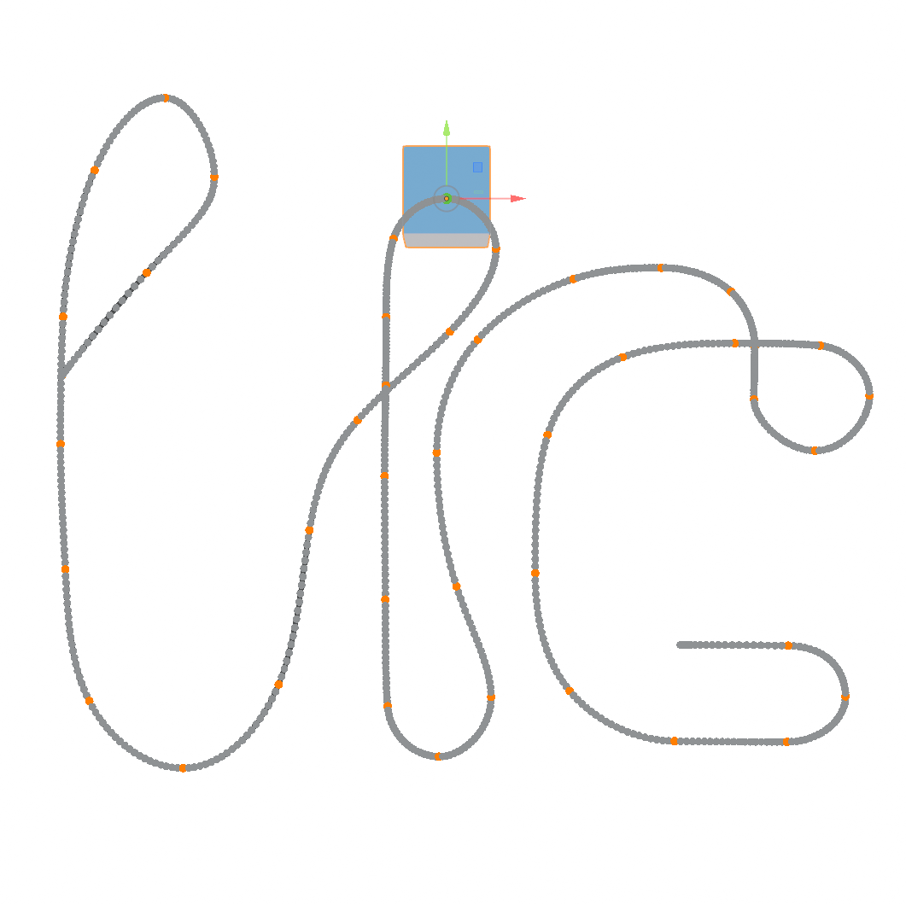
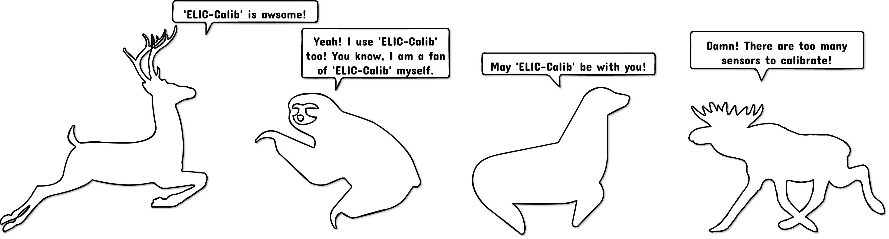
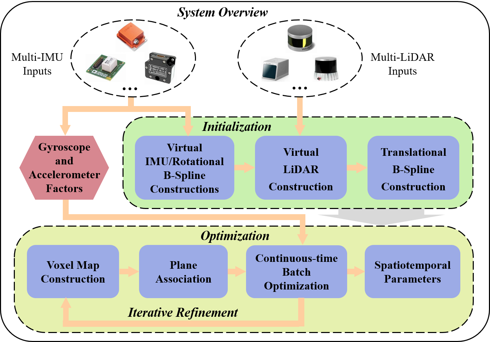
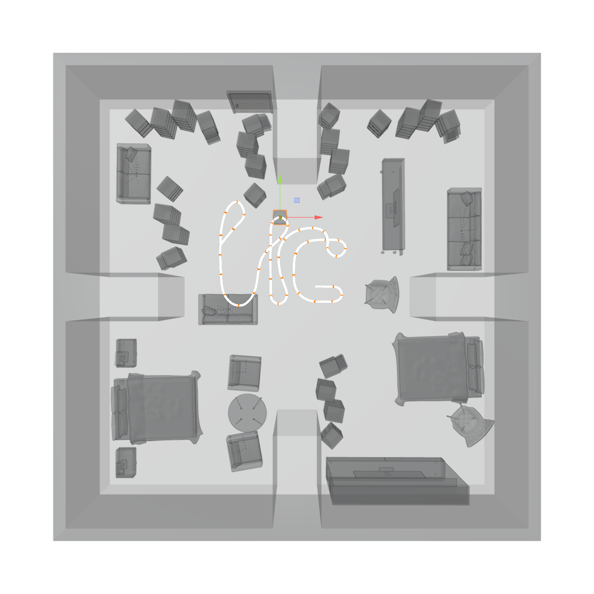
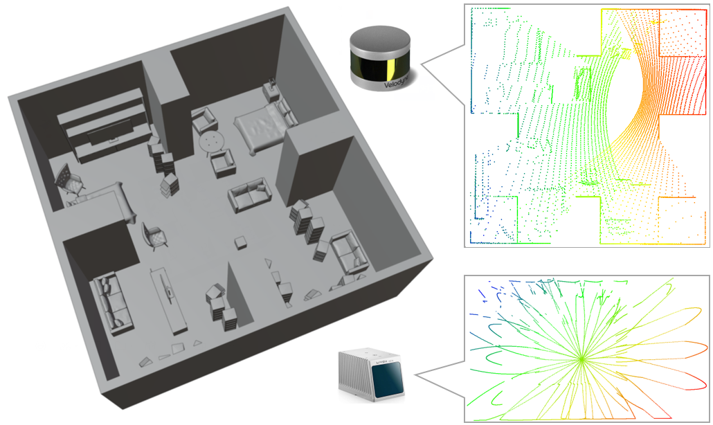
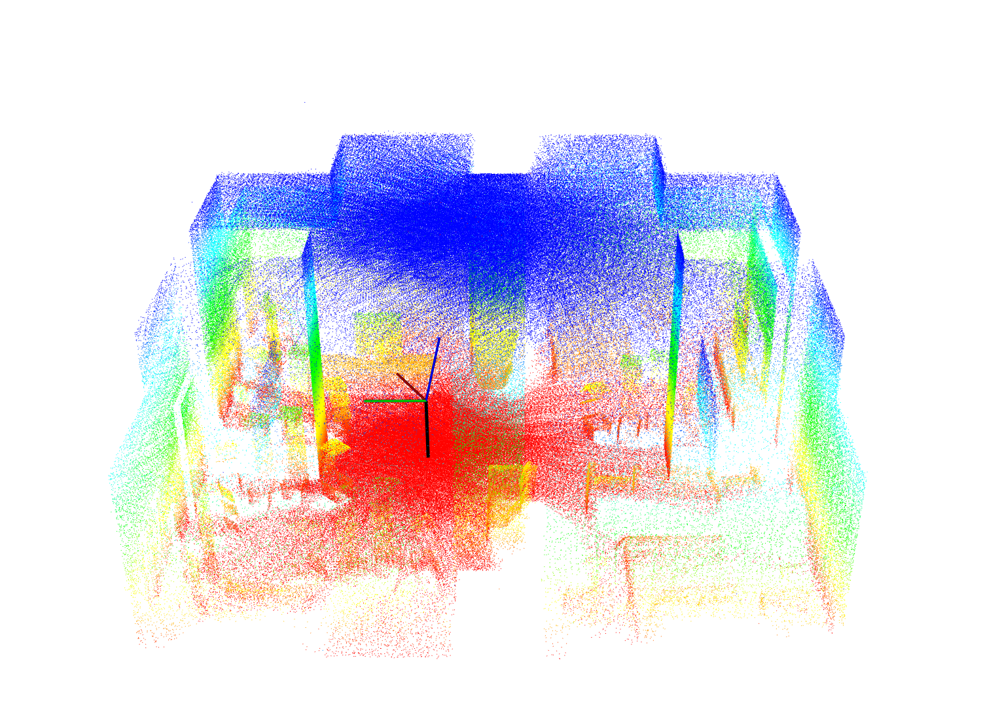
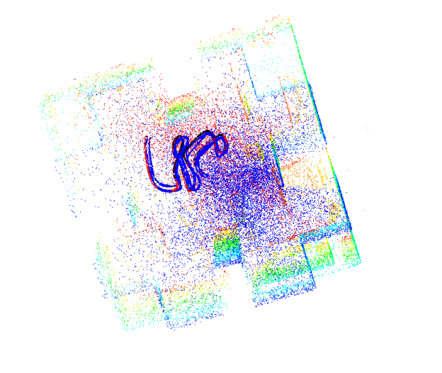
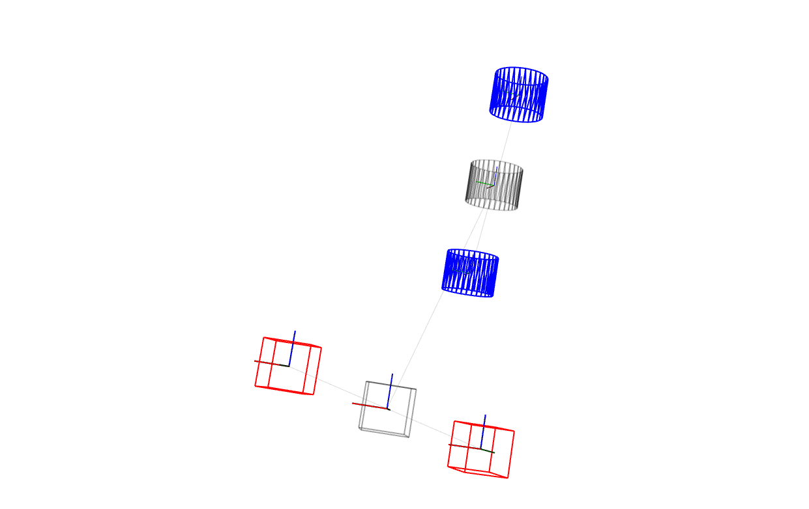
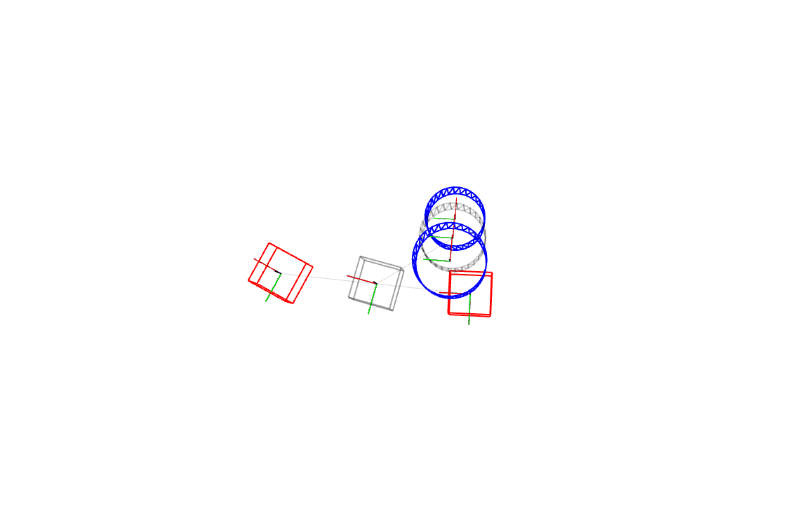
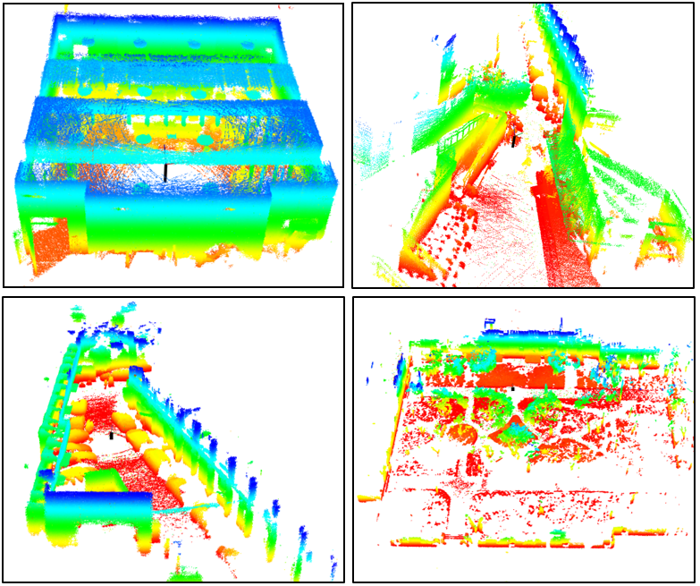

## ELIC-Calib
This is an initial version of a toolkit for spatiotemporal calibration of Multiple IMUs and Muiltple LiDARs without relying on artificial targets and specific movements. Both mechanical LiDARs (e.g., Velodyne and Ouster) and solid-state LiDAR (e.g., Livox-MID70).
<div align=center></div>

<div align=center></div>

## News
+ [2023/10/29] - Initial release of code and dataset.

## Code Structure

+ The whole project is a ROS (only tested on Ubuntu 20.04 noetic) workspace. It contains three ros packages:
    + ***elic_calib***: the main package to solve calibration issue;

+ Here are the thirdparties:

    + [ROS (noetic)](https://www.ros.org), [Ceres](http://www.ceres-solver.org), [PCL](https://pointclouds.org), [OpenCV](https://opencv.org), [OpenMVG](https://github.com/openMVG/openMVG.git), [Sophus](https://github.com/strasdat/Sophus.git), [yaml-cpp](https://github.com/jbeder/yaml-cpp.git), [magic-enum](https://github.com/Neargye/magic_enum.git), [fmt](https://github.com/fmtlib/fmt.git), [icecream-cpp](https://github.com/renatoGarcia/icecream-cpp.git), [cereal](https://github.com/USCiLab/cereal.git)

+ Here are the self-building parties:

    + [logger](https://github.com/Unsigned-Long/logger.git), [slam-scene-viewer](https://github.com/Unsigned-Long/slam-scene-viewer.git), [pretty-table](https://github.com/Unsigned-Long/pretty-table.git)

## System Overview
<div align=center></div>

## Boot ELIC-Calib

<div align='center'><font size='5' color='red'><b><i>preparation</i></b></font></div>

+ install **ROS** (for Ubuntu 20.04):

  ```bash
  sudo apt install ros-noetic-desktop-full
  echo "source /opt/ros/noetic/setup.bash" >> ~/.bashrc
  source ~/.bashrc
  ```

  note that the '**OpenCV**' and '**PCL**' libraries are integrated into it.

+ install **Ceres**:

  ```bash
  sudo apt-get install libceres-dev
  ```

+ install **OpenMVG**:

  see the GitHub Profile of **[openMVG](https://github.com/openMVG/openMVG.git)** library, clone it, compile it, and install it. Build shared library!

+ install **Sophus**:

  see the GitHub Profile of **[Sophus](https://github.com/strasdat/Sophus.git)** library, clone it, compile it, and install it.

+ install **yaml-cpp**:

  ```bash
  sudo apt-get install libyaml-cpp-dev
  ```

+ install **magic-enum**:

  see the GitHub Profile of **[magic-enum](https://github.com/Neargye/magic_enum.git)** library, clone it, compile it, and install it.

+ install **fmt**:

  ```bash
  sudo apt-get install libfmt-dev
  ```

+ install **icecream-cpp**:

  see the GitHub Profile of **[icecream-cpp](https://github.com/renatoGarcia/icecream-cpp.git)** library, clone it, compile it, and install it.

+ install **Cereal**:

  ```bash
  sudo apt-get install libcereal-dev
  ```

+ clone **submodules** of LIC-Calib:

  ```bash
  git submodule update --remote
  ```

  change directory to '**{*}/ELIC-Calib/src/elic_calib/thirdparty**', and create folder named '**slam-scene-viewer-build**' where the 'slam-scene-viewer' would be built.

  ```bash
  cd {*}/ELIC-Calib/src/elic_calib/thirdparty
  mkdir slam-scene-viewer-build
  cd slam-scene-viewer-build
  cmake ../slam-scene-viewer
  make -j8
  ```

  other modules are header-only libraries, which means they don't need to be compiled.

<div align='center'><font size='5' color='red'><b><i>compile ELIC-Calib</i></b></font></div>

+ change directory to the ros workspace (i.e., {*}/ELIC-Calib/), and run:

  ```bash
  catkin_make
  ```

  

## Run simulated dataset
A example of simulated dataset and reference spatiotemporal parameters are available at [OneDrive](https://whueducn-my.sharepoint.com/:f:/g/personal/lishengyu_whu_edu_cn/Er5siA8MLGhPrkCHwh1hMTwB4zVG5mB0oreY71tGDfA_0g?e=ZHK1UV "simu"). Note that there is no error in the simulation data. You can add Gaussian white noise error as needed. 

1. Download the simulated dataset
2. Modify the default yaml in “elic-calib.launch” to "elic-config-sim.yaml"
3. Modify the "BagPath", "ParamSavePath", "OutputDataDir" in "elic-config-real.yaml" according to your environment
4. Turn on "dt = 0.0;" on line 481 of "lidar_data_loader.cpp" and catkin_make again
5. Source it and run it! "roslaunch elic_calib elic_calib.launch"

<div align=center></div>
<div align=center></div>
<div align=center></div>


## Run real-world dataset
A example of real-world dataset and reference spatiotemporal parameters are available at [OneDrive](https://whueducn-my.sharepoint.com/:f:/g/personal/lishengyu_whu_edu_cn/Etyi3L5GWJFBkfI4YhlamFEBP2ASsvk5UTVvZvJP1UDiLg?e=Rm4yix "real").

1. Download the real-world dataset
2. Modify the default yaml in “elic-calib.launch” to "elic-config-real.yaml"
3. Modify the "BagPath", "ParamSavePath", "OutputDataDir" in "elic-config-sim.yaml" according to your environment
4. Comment out "dt = 0.0;" on line 481 of "lidar_data_loader.cpp" and catkin_make again
5. Source it and run it! "roslaunch elic_calib elic_calib.launch"

<div align=center></div>

<div align=center></div>

<div align=center></div>

## TODO
1. The NDT registration may fail when initializing livox. Using loam_livox to obtain a simple map in advance can improve the calibration success rate.
2. Due to the small field of view of Livox LiDAR, it is prone to degradation cases.
## Credit / Licensing
The codebase and documentation is licensed under the [GNU General Public License v3 (GPL-3)](https://www.gnu.org/licenses/gpl-3.0.txt).