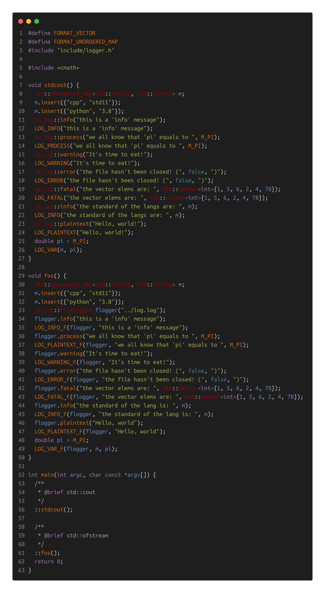
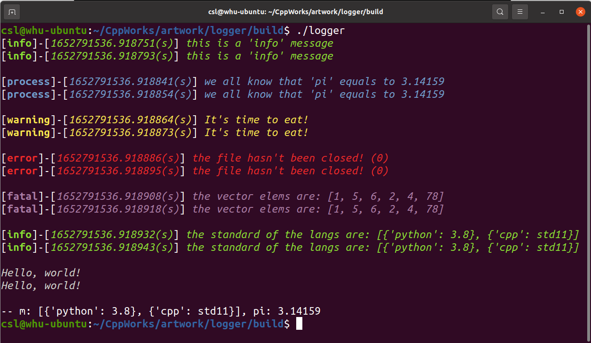
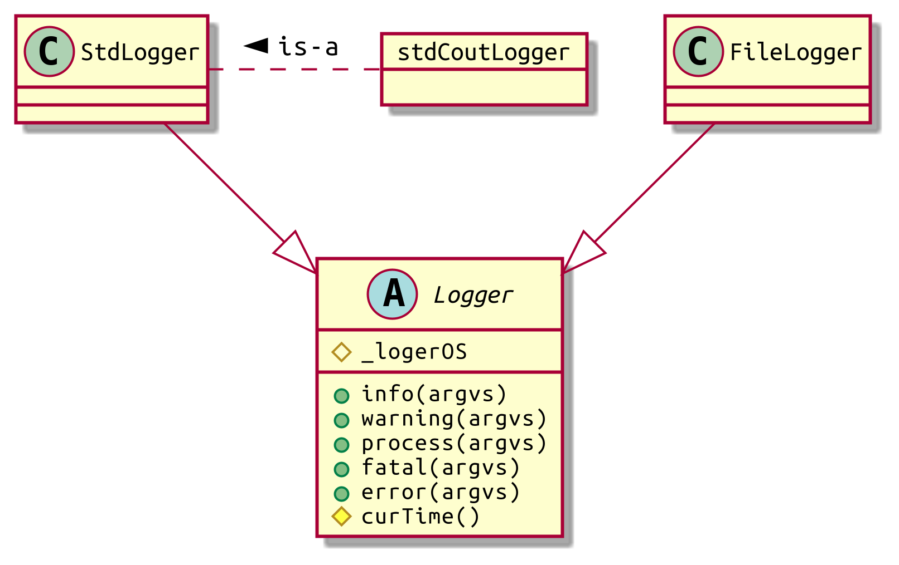

# Simple Logger
>___Author : csl___   

>___E-Mail : 3079625093@qq.com___   

[TOC]

## 1. Override

This is just a simple logger, usage is also simple.
```ABAP                                   
_|                                                          
_|          _|_|      _|_|_|    _|_|_|    _|_|    _|  _|_|  
_|        _|    _|  _|    _|  _|    _|  _|_|_|_|  _|_|      
_|        _|    _|  _|    _|  _|    _|  _|        _|        
_|_|_|_|    _|_|      _|_|_|    _|_|_|    _|_|_|  _|        
                          _|        _|                      
                      _|_|      _|_|                       
```

<center>

log message methods

|message type|describe|
|---|---| 
|info|Information; Message; real-time info Of information; Of messages; Informative;|
|process|The process of achieving a goal; The development of things, especially the steps of natural change;|
|warning|about possible accidents, etc.; a warning, warning, etc about the punishment to be suffered|
|error|Error; Errors; Fallacy;|
|fatal|Fatal; Catastrophic; Destructive; Cause failure|

</center>

<center>

format macroes for STL containers

|describe|format macroes|
|---|---|
|the map relatived containers|FORMAT_MAP FORMAT_MULTIMAP FORMAT_UNORDERED_MAP FORMAT_UNORDERED_MULTIMAP|
|the set relatived containers|FORMAT_SET FORMAT_UNORDERED_SET FORMAT_MULTISET FORMAT_UNORDERED_MULTISET|
|the sequence containers|FORMAT_VECTOR FORMAT_LIST FORMAT_DEQUE FORMAT_ARRAY|
|the stack and queue|FORMAT_STACK FORMAT_QUEUE|

</center>

## 2. Usage


output



the log file is [here](./log.log)

```apl
[info]-[1652791437.802533(s)] this is a 'info' message
[info]-[1652791437.802539(s)] this is a 'info' message

[process]-[1652791437.802588(s)] we all know that 'pi' equals to 3.14159
[process]-[1652791437.802593(s)] we all know that 'pi' equals to 3.14159

[warning]-[1652791437.802604(s)] It's time to eat!
[warning]-[1652791437.802607(s)] It's time to eat!

[error]-[1652791437.802616(s)] the file hasn't been closed! (0)
[error]-[1652791437.802619(s)] the file hasn't been closed! (0)

[fatal]-[1652791437.802628(s)] the vector elems are: [1, 5, 6, 2, 4, 78]
[fatal]-[1652791437.802632(s)] the vector elems are: [1, 5, 6, 2, 4, 78]

[info]-[1652791437.802691(s)] the standard of the lang is: [{'python': 3.8}, {'cpp': std11}]
[info]-[1652791437.802698(s)] the standard of the lang is: [{'python': 3.8}, {'cpp': std11}]

Hello, world
Hello, world

-- m: [{'python': 3.8}, {'cpp': std11}], pi: 3.14159
```

## 3. Structure

