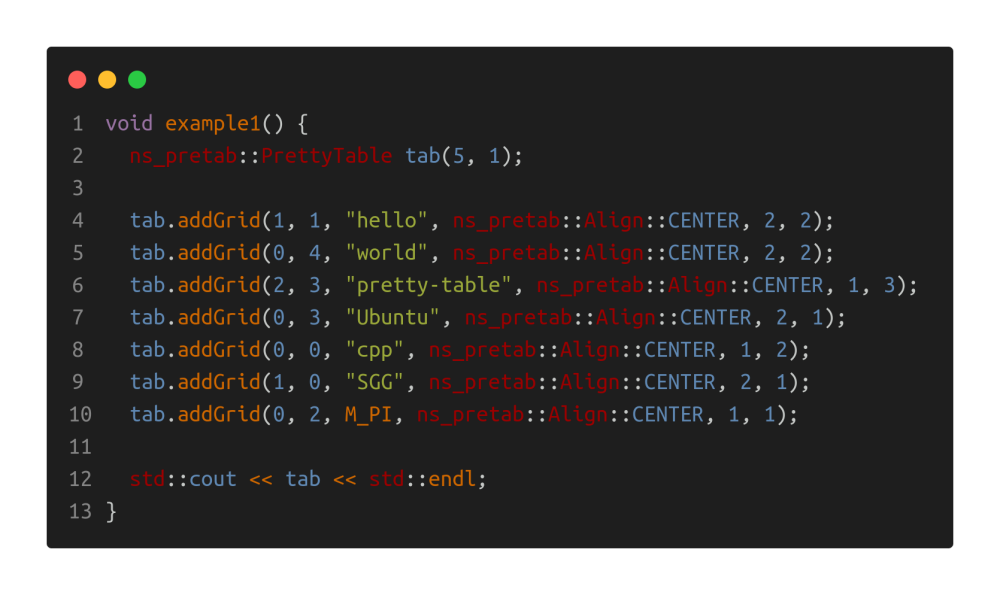
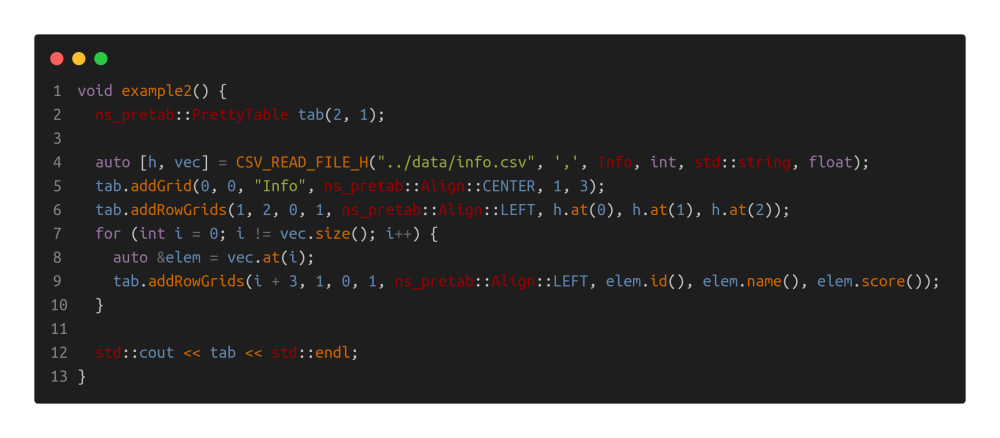
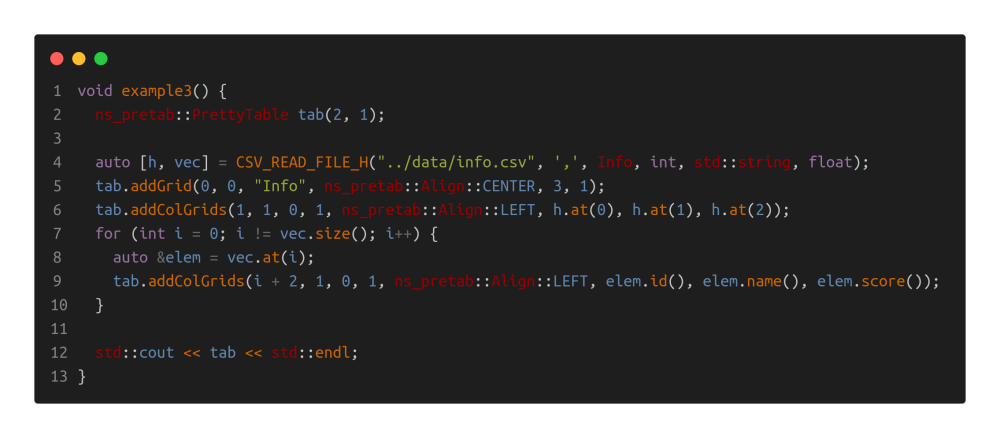
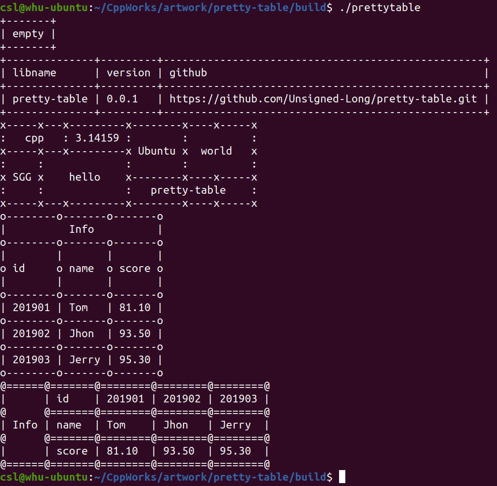

# Pretty Table

[TOC]

___Aurther: csl___

___E-Mainl: 3079625093@qq.com___

```cpp
                                _|      _|                
_|_|_|    _|  _|_|    _|_|    _|_|_|_|_|_|_|_|  _|    _|  
_|    _|  _|_|      _|_|_|_|    _|      _|      _|    _|  
_|    _|  _|        _|          _|      _|      _|    _|  
_|_|_|    _|          _|_|_|      _|_|    _|_|    _|_|_|  
_|                                                    _|  
_|                                                _|_|    
                                            
  _|                _|        _|            
_|_|_|_|    _|_|_|  _|_|_|    _|    _|_|    
  _|      _|    _|  _|    _|  _|  _|_|_|_|  
  _|      _|    _|  _|    _|  _|  _|        
    _|_|    _|_|_|  _|_|_|    _|    _|_|_|  
```


## 1. OverView

this lib is used to tabulate data on the console:

```cpp
// cpp source code
tab.addGrid(0, 0, "libname").addGrid(0, 1, "github");
tab.addGrid(1, 0, "pretty-table").addGrid(1, 1, "https://github.com/Unsigned-Long/pretty-table.git");
// output
+--------------+---------------------------------------------------+
| libname      | github                                            |
+--------------+---------------------------------------------------+
| pretty-table | https://github.com/Unsigned-Long/pretty-table.git |
+--------------+---------------------------------------------------+
```

code:



output:

```cpp
x-----x---x---------x--------x----x-----x
:   cpp   : 3.14159 :        :          :
x-----x---x---------x Ubuntu x  world   x
:     :             :        :          :
x SGG x    hello    x--------x----x-----x
:     :             :   pretty-table    :
x-----x---x---------x--------x----x-----x
```

code:



output:

```cpp
o--------o-------o-------o
|          Info          |
o--------o-------o-------o
|        |       |       |
o id     o name  o score o
|        |       |       |
o--------o-------o-------o
| 201901 | Tom   | 81.10 |
o--------o-------o-------o
| 201902 | Jhon  | 93.50 |
o--------o-------o-------o
| 201903 | Jerry | 95.30 |
o--------o-------o-------o
```

code:



output:

```cpp
@======@=======@========@========@========@
|      | id    | 201901 | 201902 | 201903 |
@      @=======@========@========@========@
| Info | name  | Tom    | Jhon   | Jerry  |
@      @=======@========@========@========@
|      | score | 81.10  | 93.50  | 95.30  |
@======@=======@========@========@========@
```

Output




## 2. Apis

### 2.1 Align

```cpp
enum class Align {
  /**
   * @brief options
   */
  RIGHT,
  LEFT,
  CENTER
};
```


### 2.2 PrettyTable

**constructor**

```cpp
/**
 * @brief Construct a new Pretty Table object
 */
explicit PrettyTable(int precision = 3, std ::size_t padding = 1,
                     char nodeChar = '+', char verticalChar = '|', char horizontalChar = '-');
```

**add a grid**

```cpp
/**
 * @brief add a grid to current table
 *
 * @tparam Type the type of the content to be added
 * @param rowIdx the row index
 * @param colIdx the column index
 * @param content the context
 * @param align the alignment
 * @param rowspan the rowspan of this grid
 * @param colspan the colspan of this grid
 */
template <typename Type>
PrettyTable &addGrid(std::size_t rowIdx, std::size_t colIdx,
                      const Type &content, Align align = Align::LEFT,
                      std::size_t rowspan = 1, std::size_t colspan = 1)
```

**add row grids**

```cpp
/**
 * @brief add row grids
 *
 * @tparam Type the type of the content to be added
 * @tparam Types the types of else contents to be added
 * @param rowIdx the row index
 * @param rowspan the rowspan for these grids
 * @param startColIdx the start column index for these contents
 * @param singleGridColspan single grid column span
 * @param align the alignment
 * @param content the content
 * @param contents else contents
 * @return PrettyTable&
 */
template <typename Type, typename... Types>
PrettyTable &addRowGrids(std::size_t rowIdx, std::size_t rowspan,
                          std::size_t startColIdx, std::size_t singleGridColspan,
                          Align align, const Type &content, const Types &...contents)
```

**add column grids**

```cpp
/**
 * @brief add column grids
 *
 * @tparam Type the type of the content to be added
 * @tparam Types the types of else contents to be added
 * @param colIdx the column index
 * @param colspan the column span for these grids
 * @param startRowIdx the start row index for these contents
 * @param singleGridRowspan single grid row span
 * @param align the alignment
 * @param content the content
 * @param contents else contents
 * @return PrettyTable&
 */
template <typename Type, typename... Types>
PrettyTable &addColGrids(std::size_t colIdx, std::size_t colspan,
                          std::size_t startRowIdx, std::size_t singleGridRowspan,
                          Align align, const Type &content, const Types &...contents)
```


